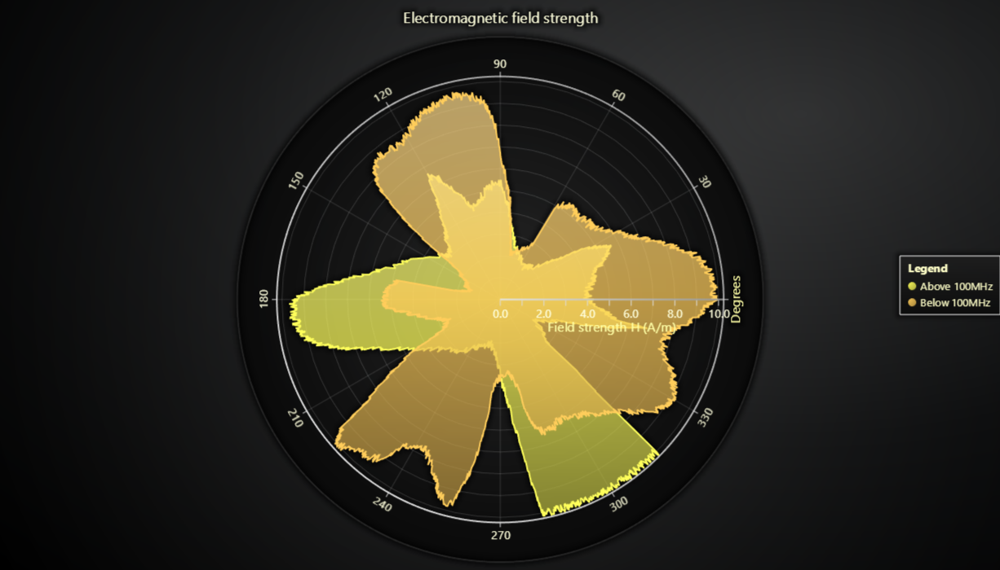

# JavaScript Polar Chart EM Field Strength



This demo application belongs to the set of examples for LightningChart JS, data visualization library for JavaScript.

LightningChart JS is entirely GPU accelerated and performance optimized charting library for presenting massive amounts of data. It offers an easy way of creating sophisticated and interactive charts and adding them to your website or web application.

The demo can be used as an example or a seed project. Local execution requires the following steps:

-   Make sure that relevant version of [Node.js](https://nodejs.org/en/download/) is installed
-   Open the project folder in a terminal:

          npm install              # fetches dependencies
          npm start                # builds an application and starts the development server

-   The application is available at _http://localhost:8080_ in your browser, webpack-dev-server provides hot reload functionality.


## Description

This example showcases a simple Polar Chart with two Area Series.

# PolarAreaSeries

_PolarAreaSeries_ connects a list of _PolarPoints_ with a stroke, and fills the enclosed area.

[//]: # 'IMPORTANT: The assets will not show before README.md is built - relative path is different!'


## Automatic closing of data points

By enabling automatic closing of data points

```typescript
PolarAreaSeries.setConnectDataAutomaticallyEnabled(true)
```

you can ensure that the highlighted area will be closed. In this picture there were only data points supplied for angles [0, 270], from there on, the data was automatically closed with a linear interpolation.


## API Links

* [Polar chart]
* [Polar area series]
* [Polar radial axis]
* [Polar amplitude axis]
* [Polar point]


## Support

If you notice an error in the example code, please open an issue on [GitHub][0] repository of the entire example.

Official [API documentation][1] can be found on [LightningChart][2] website.

If the docs and other materials do not solve your problem as well as implementation help is needed, ask on [StackOverflow][3] (tagged lightningchart).

If you think you found a bug in the LightningChart JavaScript library, please contact sales@lightningchart.com.

Direct developer email support can be purchased through a [Support Plan][4] or by contacting sales@lightningchart.com.

[0]: https://github.com/Arction/
[1]: https://lightningchart.com/lightningchart-js-api-documentation/
[2]: https://lightningchart.com
[3]: https://stackoverflow.com/questions/tagged/lightningchart
[4]: https://lightningchart.com/support-services/

© LightningChart Ltd 2009-2022. All rights reserved.


[Polar chart]: https://lightningchart.com/js-charts/api-documentation/v5.2.0/classes/PolarChart.html
[Polar area series]: https://lightningchart.com/js-charts/api-documentation/v5.2.0/classes/PolarAreaSeriesInterior.html
[Polar radial axis]: https://lightningchart.com/js-charts/api-documentation/v5.2.0/interfaces/PolarAxisRadial.html
[Polar amplitude axis]: https://lightningchart.com/js-charts/api-documentation/v5.2.0/classes/PolarAxisAmplitude.html
[Polar point]: https://lightningchart.com/js-charts/api-documentation/v5.2.0/interfaces/PolarPoint.html

